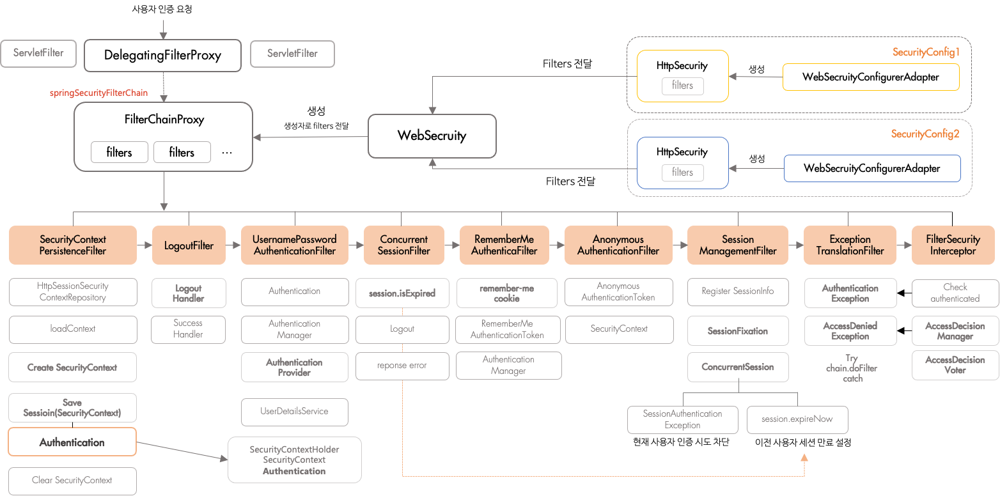

# Spring Security Architecture

## 인증과 권한 (Authentication and Access Control)
AuthenticationManager, GrantedAuthority, AuthorizationManager

### 인증의 중심 인터페이스 AuthenticationManager
```java
public interface AuthenticationManager {
  Authentication authenticate(Authentication authentication)
    throws AuthenticationException;
}
```

```
AuthenticationManager - ProviderManager
ProviderManager -> ...AuthenticationProvider

(ProviderManager has AuthenticationProvider list)
```

--- 

### 권한의 핵심 인터페이스 AuthorizationManager  
AuthorizationManager 실제 권한제어를 수행한다. 
AccessDecisionManager와 AccessDecisionVoter를 대체한다

```java
public interface AuthorizationManager<T> {
	void verify(Supplier<Authentication> authentication, T object);

	AuthorizationDecision check(Supplier<Authentication> authentication, T object);
}
```
check메소드에 권한결정에 필요한 모든 정보를 인자로 넘겨 이를 바탕으로 AuthorizationDecision를 리턴한다. 

verify에서 check를 호출하고 AuthorizationDecision 결과에 따라 AccessDeniedException를 던진다. (default)

### GrantedAuthority

GrantedAuthority 권한의 종류를 표현. 
``` java
interface GrantedAuthority {
    String getAuthority();
}
```
Spring Security는 이를 가장 간단하게 구현한 SimpleGrantedAuthority구현체를 제공한다.
디폴트 동작으로 ROLE기반 권한체계에서 ROLE_이라는 접두사가 추가된다.
USER 라는 권한을 찾으면 getAuthority의 결과로 ROLE_USER라는 값이 리턴되는 것을 찾는다. 
이를 커스터마이징하고 싶으면 GrantedAuthorityDefaults를 찾아보면된다.

### AuthorizationFilter
mvc 환경에서 실제 권한체크가 이루어지는 필터인듯하다.

얘가 메인으로 가지고 있는 AuthorizationManager는 RequestMatcherDelegatingAuthorizationManager이다 (현 테스트 환경에서)

---

## Web Security 필터 

__스프링 시큐리티는 서블릿 필터 계층에 존재한다.__
  
필터는 리퀘스트를 자체적으로 처리하길 원한다면 남아있는 필터체인의 필터를 무시할수 있다  
필터는 리퀘스트와 리스폰스를 수정할수 있는 권한을 가지고 있으며 수정된 리퀘스트와 리스폰스는 다른 필터와 서블릿에게 전달된다.  

실제 필터를 생성하는 클래스는 HttpSecurity 클래스이다.

필터의 순서는 매우 중요하다.
필터의 순서를 지정하는 방법은 2가지가 있는데 
첫번째는 필터가 빈으로 괸리될경우 @Order 나 Ordered 인터페이스를 구현할수있고 
두번째는 필터를 FilterRegistrationBean로 만들어 빈으로 등록하는것이다.

스프링 시큐리티는 체인의 하나의 필터에 설치된다.
이 필터는 FilterChainProxy 타입이다.
이것은 빈으로 관리되면 모든 요청에 적용되도록 기본적으로 설정된다. 
이 필터의 순서는 SecurityProperties.DEFAULT_FILTER_ORDER 옵션으로 결정된다. 
물리적인 필터는 하나이지만 이안에는 스프링시큐리티의 여러필터를 담고있는 형태이다.

[HttpSecurity와 WebSecurity의 차이](./HttpSecurity와%20WebSecurity의%20차이.md)
```
package org.springframework.security.web;
Filter - GenericFilterBean - FilterChainProxy
FilterChainProxy has SecurityFilterChain list
```

# 스프링 시큐리티는 물리적으로 하나의 필터만 가지고 있다. ???
사실 시큐리티는 하나의 필터만 가지는 것은 아니다
DelegatingFilterProxy라는 필터를 하나더 가지고 있다.
DelegatingFilterProxy는 빈으로 관리되지 않고 컨테이너안에 존재한다.

하지만 FilterChainProxy는 언제나 빈으로 관리된다.
얘는 springSecurityFilterChain 

```
DelegatingFilterProxy
package org.springframework.web.filter;

Filter - GenericFilterBean - DelegatingFilterProxy
```

## 
필터가 커스텀되지 않은 바닐라 스프링부트앱에는 기본적인 필터가 설정되어있다.
그중 첫번째 체인은 정적리소스패턴을 무시하기 위해 존재한다,
마지막 체인은 /** 모든 경로에 대한 필터이다.

부트앱에서 모든 시큐리티 필터가 컨테이너에게 알려지지 않는다는 사실은 중요하다.
@Bean 타압의 모든 Filter 구현체는 자동으로 컨테이너에게 등록된다.
시큐리티 체인에 커스텀한 

# 


## 참고
[공식문서](https://spring.io/guides/topicals/spring-security-architecture/)
[스프링 부트에 필터를 '조심해서' 사용하는 두 가지 방법](https://taetaetae.github.io/2020/04/06/spring-boot-filter/#%EB%B0%A9%EB%B2%95-1--filterregistrationbean)
[스프링 시큐리티 기본 API및 Filter 이해](https://catsbi.oopy.io/c0a4f395-24b2-44e5-8eeb-275d19e2a536)
[권한 부여(Authorization) 처리 흐름](https://velog.io/@bimilless/Spring-Security%EC%9D%98-%EA%B6%8C%ED%95%9C-%EB%B6%80%EC%97%AC-%EC%B2%98%EB%A6%AC-%ED%9D%90%EB%A6%84)
