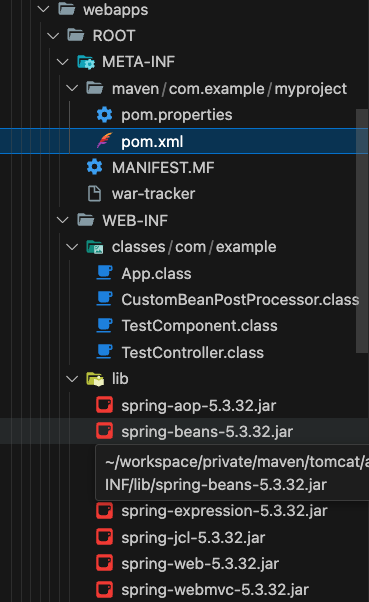

# 과정 개요
1. mvn 프로젝트 생성
1. [톰캣 다운로드및 설치](#톰캣-다운로드및-설치)
1. [스프링 의존성 설치](#스프링-의존성-설치)
1. [스프링 mvc 설정](#스프링-mvc-설정)
1. 기본적인 컨트롤러 생성
1. 프로젝트 war로 패키지
1. war 톰캣으로 배포 
1. 브라우저에서 컨트롤러 url 호출해보기

---

# 톰캣 다운로드및 설치
공홈에서 다운받고 압축푼 다음 bin 아래 프로그램을 실행해 서버를 실행하고 종료한다.

```bash 
bin/startup.sh
bin/shutdown.sh
```

---

# 스프링 의존성 설치
```
spring-webmvc
javax.servlet-api
```

javax.servlet-api는 ServletContext에 접근하기 위함.

---

# 스프링 mvc 설정
## @EnableWebMvc
xml 베이스
```xml
<mvc:annotation-driven/>
```
Java 베이스
```java
@EnableWebMvc
```
두 코드는 같은 역할을 하며 @Contoller가 붙은 클래스를 스캔해 웹 컨트롤러의 형태의 빈으로 생성해준다.
xml을 사용하지 않고 java config로 구성하면 아래 두 어노테이션이 붙은 클래스를 작성하면된다.
@Configuration이 없다면 제대로 동작하지 않는다.
```java
@Configuration
@EnableWebMvc
```

## WebApplicationInitializer
web.xml로 다루는 루트 컨텍스트나 서블릿 컨텍스트를 자바코드로 다룰 수 있게한다. 서블릿 3.0 이상에서 지원

---

## spring-mvc로 구성한 프로젝트의 main 메소드는 어디있는 걸까? 
spring mvc는 tomcat과 같은 서블릿 컨테이너에서만 실행될 수 있는 서블릿기반 웹 프레임워크이다.
그렇기 때문에 서블릿 스펙에 의존적이며 main함수와 같은 프로그램의 시작점은 서블릿 컨테이너에 포함되어 있을것이다.
[https://stackoverflow.com/questions/44297353/main-method-in-a-spring-mvc-application]

## 빌드된 war파일의 구성 내용


---

# 참고
[https://kimcoder.tistory.com/511]